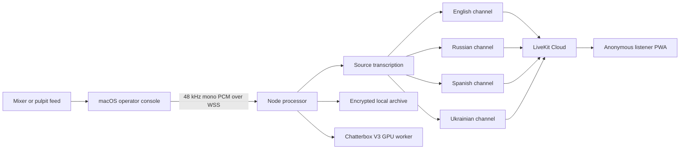

# Architecture

## System shape

One channel failing does not stop the other languages. Configuration is immutable after Start, except mute, cloned-to-natural fallback, and channel restart.

## Components

### Operator console

The Tauri shell is a private controller. The Web Audio capture path requests a mono, 48 kHz, unprocessed input and sends 20 ms signed 16-bit frames. Remote capture is rejected without TLS in production. The Rust shell provides native input enumeration and the macOS microphone usage declaration.

### Processor

The processor owns every provider credential and the authoritative session state. It validates all operator input with Zod, limits the system to one church service, sequences each target independently, measures backlog, and automatically moves cloned output to the natural renderer after ten seconds.

Provider-specific events do not enter UI state. The shared boundaries are:

- `Transcriber`
- `TranslationProvider`
- `SpeechRenderer`
- `MediaRelay`
- `ArchiveStore`

### Translation providers

The intended cloud primary is [GPT-Realtime-Translate](https://developers.openai.com/api/docs/models/gpt-realtime-translate), with [GPT-Live-Transcribe](https://developers.openai.com/api/docs/models/gpt-live-transcribe) for source captions and archives.

The implemented and locally testable fallback chunks source audio, transcribes it, translates text with glossary/context, and renders speech. This is intentionally kept behind the same contracts so the Realtime compatibility spike does not reshape product state.

The later local provider must pass the same test suite before automatic selection:

- faster-whisper large-v3-turbo
- TranslateGemma 12B
- Chatterbox Multilingual V3
- Piper `uk_UA`

Muse Glimmer is not a translation provider.

### Voice identity

Identity and prosody are separate controls. Chatterbox V3 supplies the consented timbre. Chunk timing, punctuation, source pace, energy, and conservative exaggeration guide delivery. Exact pitch copying is neither implemented nor promised.

The first clone policy is RU to EN for the explicitly authorized preacher. The worker refuses absent/revoked profiles, encrypts reference samples with AES-256-GCM, and deletes the encrypted sample when revoked.

### Relay and listener

The processor joins one LiveKit room as a publish-only participant and creates a source or translation track per configured language. The public token has a five-minute lifetime and grants room join plus subscribe only; publish and data-publish are explicitly false.

The Cloudflare Worker exposes only three public endpoints: service state, listener token, and caption events. All private API paths return 404.

### Archive

During a service, the archive uses 48 kHz PCM working files. Finalization encodes each non-empty channel as mono Opus, hashes every track and transcript, writes an integrity hash into the manifest, and updates SQLite. Expired, non-retained sessions are purged hourly.

Production mounts must be root-owned storage on an encrypted Linux volume. The container runs as UID 10001 and has access only to its dedicated volume.

## Latency budget

The acceptance target is p95 capture-to-listener audio at or below ten seconds. The fallback chunker uses five seconds of source context, leaving roughly five seconds for transcription, translation, rendering, relay, and network delivery. If this cannot remain bounded for two hours, the channel is not service-ready.
